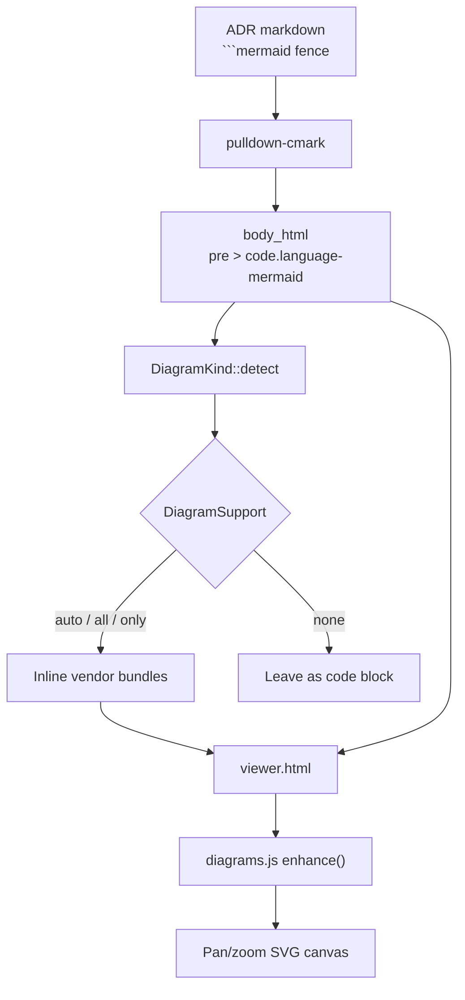

## Context

Architecture decisions are frequently explained with a diagram, but ADRScope
rendered diagram code blocks as literal source text. Authors worked around this
by committing exported images next to the ADR, which drift from the source and
cannot be zoomed or inspected.

Three formats cover almost all of the diagrams found in practice: Mermaid for
quick flow and sequence diagrams, draw.io for detailed architecture drawings,
and Excalidraw for sketches. Each ships a browser renderer that produces SVG.

Two implementation strategies were evaluated.

**Pre-render during generation.** Turn each diagram into static SVG in the Rust
pipeline. Native Rust Mermaid renderers now exist, but they are pre-1.0 and do
not promise parity with mermaid.js, and no Rust renderer exists for draw.io or
Excalidraw at all. This option also cannot offer interaction.

**Render client-side in the viewer.** The markdown pipeline already emits
`<pre><code class="language-mermaid">` for a fenced block, so the Rust side
needs no change at all. The renderers are embedded as JavaScript and upgrade
the code blocks after the detail panel opens.

The cost of the second option is weight. The bundles measure 5.3 MB (Mermaid),
2.6 MB (draw.io) and 2.2 MB (Excalidraw, with its 17 MB of embedded handwriting
fonts stripped). Embedding all three unconditionally would grow every generated
viewer from roughly 100 KB to over 10 MB, including viewers for ADR sets that
contain no diagrams at all.

## Decision

Diagrams are rendered client-side, and the generator embeds a renderer only
when the ADR corpus actually uses it.

`DiagramKind` scans the pre-rendered HTML bodies for `class="language-*"`
markers, and `DiagramSupport` turns that into the set of bundles to inline.
The `--diagrams` flag overrides the default: `auto` (detect), `all`, `none`, or
an explicit list such as `mermaid,drawio`.

All three renderers produce SVG, so the viewer wraps every diagram in one shared
canvas with wheel zoom, drag panning, fit-to-view and fullscreen, rather than
exposing three different interaction models.

Renderer bundles are vendored under `templates/vendor/` and refreshed by
`scripts/vendor-diagrams.sh`, so builds never touch the network.

## Consequences

**Positive**

- Diagrams stay in the ADR as reviewable text; no exported images to keep in sync.
- The viewer remains a single self-contained file that works offline from `file://`.
- ADR sets without diagrams generate exactly the same output as before.
- One interaction model across all three formats.

**Negative**

- A viewer that uses all three formats is roughly 10 MB.
- The vendored bundles add about 10 MB to the compiled binary.
- Excalidraw text renders in a system sans-serif, because its handwriting fonts
  are stripped during vendoring; re-vendor with `KEEP_FONTS=1` to restore them.
- draw.io shape libraries that load stencils lazily are unavailable offline, so
  such shapes fall back to plain rectangles.

## Rendering pipeline

