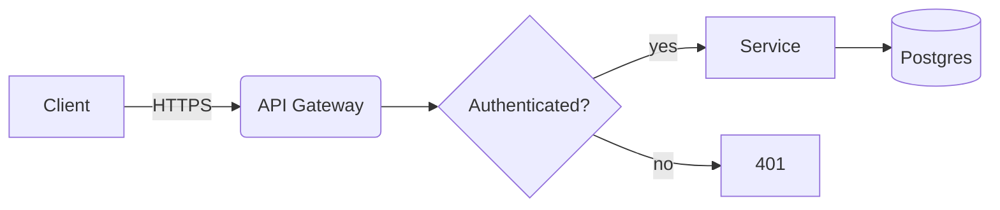
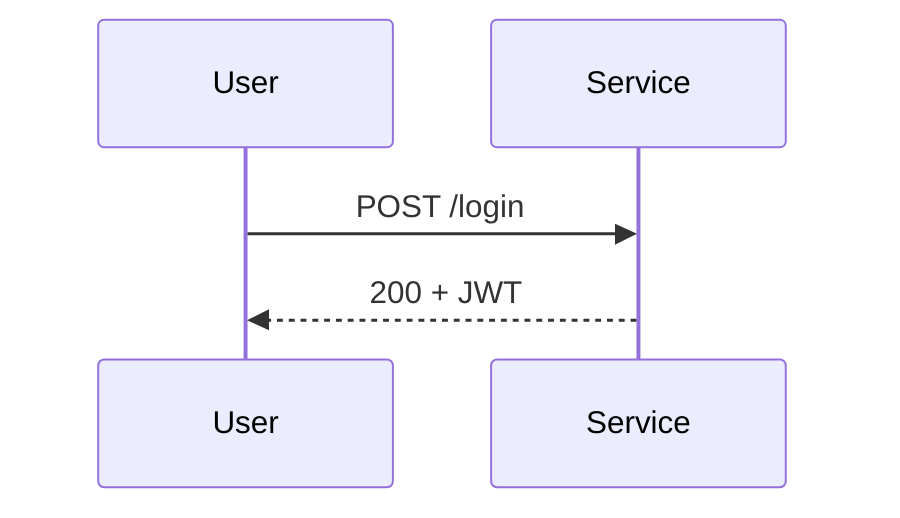

## Context

This ADR exists to exercise inline diagram rendering. Generate a viewer from it
with:

```
adrscope generate --input examples/diagrams --output examples/diagrams.html
```

Every canvas below supports wheel zoom, drag panning, double-click to fit, and
fullscreen.

## Mermaid

A ```` ```mermaid ```` fence holds Mermaid source verbatim.





## draw.io

A ```` ```drawio ```` fence holds the contents of a `.drawio` file — the
`mxfile` XML, uncompressed. In the draw.io editor use *Extras → Edit Diagram* to
copy it, or save the file with *File → Properties → Compressed* turned off.

```drawio
<mxfile host="app.diagrams.net"><diagram name="Page-1" id="p1"><mxGraphModel dx="900" dy="600" grid="0" gridSize="10" guides="1" tooltips="1" connect="1" arrows="1" fold="1" page="1" pageScale="1" pageWidth="850" pageHeight="1100" math="0" shadow="0"><root><mxCell id="0"/><mxCell id="1" parent="0"/><mxCell id="n1" value="Browser" style="rounded=1;whiteSpace=wrap;html=1;fillColor=#dae8fc;strokeColor=#6c8ebf;" vertex="1" parent="1"><mxGeometry x="40" y="40" width="140" height="60" as="geometry"/></mxCell><mxCell id="n2" value="adrscope generate" style="rounded=0;whiteSpace=wrap;html=1;fillColor=#d5e8d4;strokeColor=#82b366;" vertex="1" parent="1"><mxGeometry x="260" y="40" width="180" height="60" as="geometry"/></mxCell><mxCell id="n3" value="docs/decisions" style="shape=cylinder3;whiteSpace=wrap;html=1;boundedLbl=1;backgroundOutline=1;size=15;fillColor=#ffe6cc;strokeColor=#d79b00;" vertex="1" parent="1"><mxGeometry x="300" y="200" width="100" height="100" as="geometry"/></mxCell><mxCell id="e1" value="opens adrs.html" style="edgeStyle=orthogonalEdgeStyle;html=1;" edge="1" parent="1" source="n2" target="n1"><mxGeometry relative="1" as="geometry"/></mxCell><mxCell id="e2" value="reads" style="edgeStyle=orthogonalEdgeStyle;html=1;" edge="1" parent="1" source="n2" target="n3"><mxGeometry relative="1" as="geometry"/></mxCell></root></mxGraphModel></diagram></mxfile>
```

## Excalidraw

An ```` ```excalidraw ```` fence holds the contents of an `.excalidraw` file,
which is plain scene JSON.

```excalidraw
{
  "type": "excalidraw",
  "version": 2,
  "source": "adrscope-example",
  "elements": [
    {
      "id": "r1",
      "type": "rectangle",
      "x": 40,
      "y": 40,
      "width": 200,
      "height": 90,
      "angle": 0,
      "strokeColor": "#1e1e1e",
      "backgroundColor": "#a5d8ff",
      "fillStyle": "solid",
      "strokeWidth": 2,
      "strokeStyle": "solid",
      "roughness": 1,
      "opacity": 100,
      "groupIds": [],
      "frameId": null,
      "roundness": {
        "type": 3
      },
      "seed": 1234567,
      "version": 1,
      "versionNonce": 1,
      "isDeleted": false,
      "boundElements": null,
      "updated": 1,
      "link": null,
      "locked": false
    },
    {
      "id": "r2",
      "type": "rectangle",
      "x": 360,
      "y": 40,
      "width": 200,
      "height": 90,
      "angle": 0,
      "strokeColor": "#1e1e1e",
      "backgroundColor": "#b2f2bb",
      "fillStyle": "solid",
      "strokeWidth": 2,
      "strokeStyle": "solid",
      "roughness": 1,
      "opacity": 100,
      "groupIds": [],
      "frameId": null,
      "roundness": {
        "type": 3
      },
      "seed": 1234567,
      "version": 1,
      "versionNonce": 1,
      "isDeleted": false,
      "boundElements": null,
      "updated": 1,
      "link": null,
      "locked": false
    },
    {
      "id": "t1",
      "type": "text",
      "x": 70,
      "y": 75,
      "width": 150,
      "height": 25,
      "angle": 0,
      "strokeColor": "#1e1e1e",
      "backgroundColor": "transparent",
      "fillStyle": "solid",
      "strokeWidth": 2,
      "strokeStyle": "solid",
      "roughness": 1,
      "opacity": 100,
      "groupIds": [],
      "frameId": null,
      "roundness": {
        "type": 3
      },
      "seed": 1234567,
      "version": 1,
      "versionNonce": 1,
      "isDeleted": false,
      "boundElements": null,
      "updated": 1,
      "link": null,
      "locked": false,
      "text": "ADR markdown",
      "originalText": "ADR markdown",
      "fontSize": 20,
      "fontFamily": 1,
      "textAlign": "left",
      "verticalAlign": "top",
      "containerId": null,
      "lineHeight": 1.25
    },
    {
      "id": "t2",
      "type": "text",
      "x": 395,
      "y": 75,
      "width": 140,
      "height": 25,
      "angle": 0,
      "strokeColor": "#1e1e1e",
      "backgroundColor": "transparent",
      "fillStyle": "solid",
      "strokeWidth": 2,
      "strokeStyle": "solid",
      "roughness": 1,
      "opacity": 100,
      "groupIds": [],
      "frameId": null,
      "roundness": {
        "type": 3
      },
      "seed": 1234567,
      "version": 1,
      "versionNonce": 1,
      "isDeleted": false,
      "boundElements": null,
      "updated": 1,
      "link": null,
      "locked": false,
      "text": "SVG canvas",
      "originalText": "SVG canvas",
      "fontSize": 20,
      "fontFamily": 1,
      "textAlign": "left",
      "verticalAlign": "top",
      "containerId": null,
      "lineHeight": 1.25
    },
    {
      "id": "a1",
      "type": "arrow",
      "x": 250,
      "y": 85,
      "width": 100,
      "height": 0,
      "angle": 0,
      "strokeColor": "#1e1e1e",
      "backgroundColor": "transparent",
      "fillStyle": "solid",
      "strokeWidth": 2,
      "strokeStyle": "solid",
      "roughness": 1,
      "opacity": 100,
      "groupIds": [],
      "frameId": null,
      "roundness": {
        "type": 3
      },
      "seed": 1234567,
      "version": 1,
      "versionNonce": 1,
      "isDeleted": false,
      "boundElements": null,
      "updated": 1,
      "link": null,
      "locked": false,
      "points": [
        [
          0,
          0
        ],
        [
          100,
          0
        ]
      ],
      "lastCommittedPoint": null,
      "startBinding": null,
      "endBinding": null,
      "startArrowhead": null,
      "endArrowhead": "arrow"
    }
  ],
  "appState": {
    "viewBackgroundColor": "#ffffff",
    "gridSize": null
  },
  "files": {}
}
```

## Consequences

Diagram sources live in the ADR itself, so they are reviewed in pull requests
like any other change.
